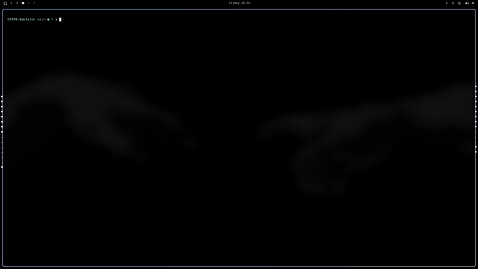
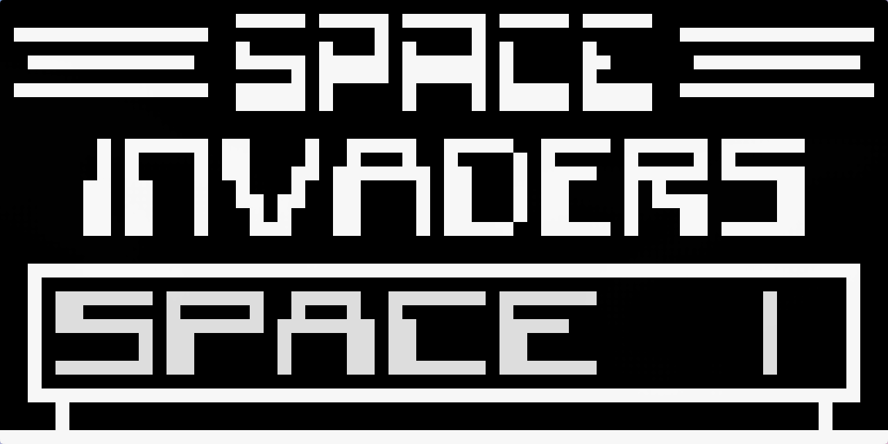

# Chip8-Emulator
CHIP-8 is an interpreted programming language developed by Joseph Weisbecker in the mid-1970s.
It was initially used on the COSMAC VIP and Telmac 1800 8-bit microcomputers to make game programming easier.
CHIP-8 programs are run using a CHIP-8 virtual machine (Wikipedia).

This emulator is designed to run games for the original CHIP-8. 

## Showcase

*Tetris*


*Space Invaders*

## Requirements 
You need:
- A C++ compiler 
- CMake (>=3.16)
- SDL3 development files 

## Build and Run
```
$ cmake -S . -B build
$ cmake --build build -j
```

Run with:
```
$ ./chip8 ./path/to/rom.ch8
```

Some games have already been provided in ./games but more can be found at:
- https://github.com/kripod/chip8-roms
- https://johnearnest.github.io/chip8Archive/

There are multiple versions of chip8, ensure that the game you are downloading is intended for the original version.
